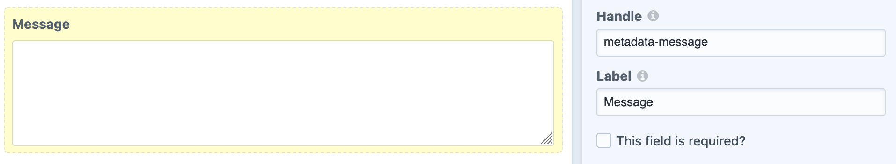
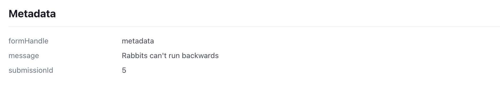
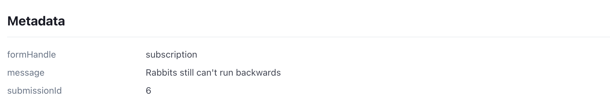

# Stripe Metadata Helper Plugin for use with Freeform Pro, Craft CMS 3.x|4.x

Stripe Metadata for Freeform is a simple plugin which enables attaching information collected on Freeform Pro payment forms to the underlying Stripe payments and subscriptions as metadata. It does this by detecting fields using a simple field-name matching which it then applies to the Stripe entity (payment or subscription) when the payment succeeds.

**Note**: This plugin is not affiliate with Solspace, the developers of the Freeform plugin.

## Requirements

* Craft CMS 3.1+|4.0+
* PHP 7.0+|8.0+
* Solspace Freeform 3.3+|4.0+ (Pro)

## Overview

The plugin will listen to Freeform Submission EVENT_AFTER_SUBMIT event. If the submission has an attached payment or subscription the plugin will attempt to attach metadata. First the plugin will iterate over the form fields and extract any fields with handles beginning with `metadata-`, the rest of the handle will be the metadata field handle in Stripe. It will then attempt to apply the metadata to either the Stripe PaymentIntent in the case of a single payment, or a Stripe Subscription in the case of a recurrent payment.

## Example

To use the plugin, add a field to your form where the handle starts with `metadata-`. The metadata field name will then be formed by everything following the dash. For example, this form has a textarea field with the handle `metadata-message` which will create a `message` field on the Stripe PaymentIntent/Subscription.

On a form set up to collect a single payment, the PaymentIntent will have the metadata added:

For forms which collect a subscription, the metadata will be added to the subscription, which can be accessed from subscriptions or from the metadata of the PaymentIntent of the initial payment:

